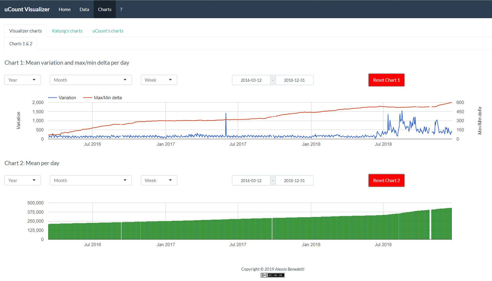

# uCountVisualizer
uCount Visualizer renews uCount with a breath of freshness: data examination has been made more easy and charts section was improved with additional plots. Moreover moving the project in [R](https://www.r-project.org) under [shiny apps](https://www.shinyapps.io) framework, gave it a readiness for further improvements.

uCount Visualizer is available [here](http://apps.alessiobenedetti.com/shiny/uCountVis).

 This work is licensed under a <a rel="license" href="http://creativecommons.org/licenses/by-nc-sa/4.0/">Creative Commons Attribution-NonCommercial-ShareAlike 4.0 International License.</a>
